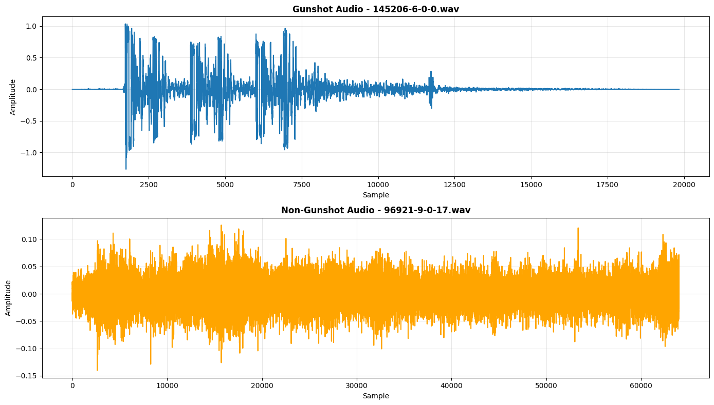
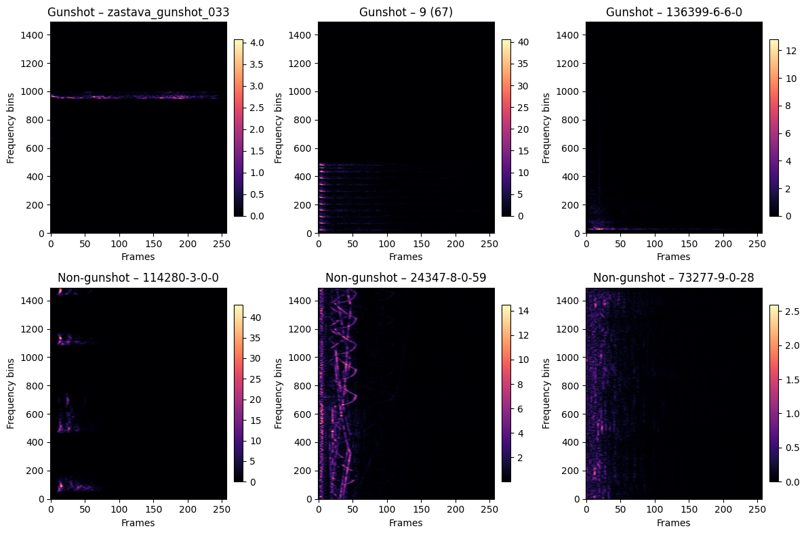

# Gunshot Detection Model




## Project Overview
This project trains and evaluates a binary gunshot detector built on short-time Fourier transform (STFT) spectrograms. Raw 3-second mono clips are resampled to 16 kHz, converted into magnitude spectrograms of shape `1491×257×1`, and fed into a convolutional neural network that distinguishes gunshot versus non-gunshot sounds. Trained TensorFlow/Keras models are saved in `models/` and can be exercised on real audio through an inference CLI (`src/test_model.py`) that performs sliding-window analysis, prints detections, and writes timestamped logs to `logs/`.

## Repository Layout
- `data/` – Raw audio, balanced binary splits, generated spectrograms, and held-out samples
- `models/` – Saved `.keras` checkpoints with timestamped filenames
- `notebooks/` – Jupyter notebooks for data exploration and model training (`feature_extraction_model_training.ipynb`)
- `src/` – Utility scripts (`download_dataset.py`, `test_model.py`)
- `requirements.txt` – Python dependencies for training and inference

## Datasets
| Dataset | Purpose | Citation |
| --- | --- | --- |
| `data/gunshot-audio-dataset/` | Positive gunshot samples used for binary classification | T. Tuncer, S. Dogan, E. Akbal, E. Aydemir, "An Automated Gunshot Audio Classification Method Based on Finger Pattern Feature Generator and Iterative Relieff Feature Selector," *Journal of Engineering Science of Adıyaman University*, 2021. |
| `data/urbansound8k/` & `data/urbansound8k_by_class/` | Ambient/non-gunshot sounds for negative samples | J. Salamon, C. Jacoby, and J. P. Bello, "A Dataset and Taxonomy for Urban Sound Research," *ACM Multimedia*, 2014. |

## Environment Setup
```bash
python -m venv .venv
source .venv/bin/activate
pip install -r requirements.txt
```

## Training Workflow
1. **Prepare data**: Use the notebooks in `notebooks/` to balance gunshot and non-gunshot clips, then convert them to spectrogram `.npy` files under `data/binary_spectrograms/`.
2. **Train the CNN**: Run `feature_extraction_model_training.ipynb` (or port the cells into a Python script) to build the `tf.data` pipeline, train the Sequential CNN, and save the resulting model into `models/` with an automatic timestamp.

## Inference Script (`src/test_model.py`)
- Loads the latest `.keras` file (or a user-specified model via `--model`).
- Accepts a file or directory of audio in common formats (WAV, MP3, FLAC, OGG, M4A).
- Applies a 3-second sliding window with 1-second hop, matching the training preprocessing.
- Prints detections with timestamps and confidence scores while also logging them to `logs/test_model_YYYYMMDD-HHMMSS.log`.

Example:
```bash
python src/test_model.py \
    --model models/binary_cnn_20251125-165301.keras \
    --threshold 0.6 \
    data/test_samples
```

## Logging
Every run of `src/test_model.py` mirrors console output into a timestamped log inside `logs/`. This makes it easy to audit predictions or attach evidence to experiment notes.

## Next Steps
- Experiment with alternative architectures (e.g., EfficientNet or CRNNs).
- Extend datasets with additional urban scenes or simulated gunshot mixes.
- Deploy the inference pipeline behind a REST API or streaming listener for real-time alerts.
